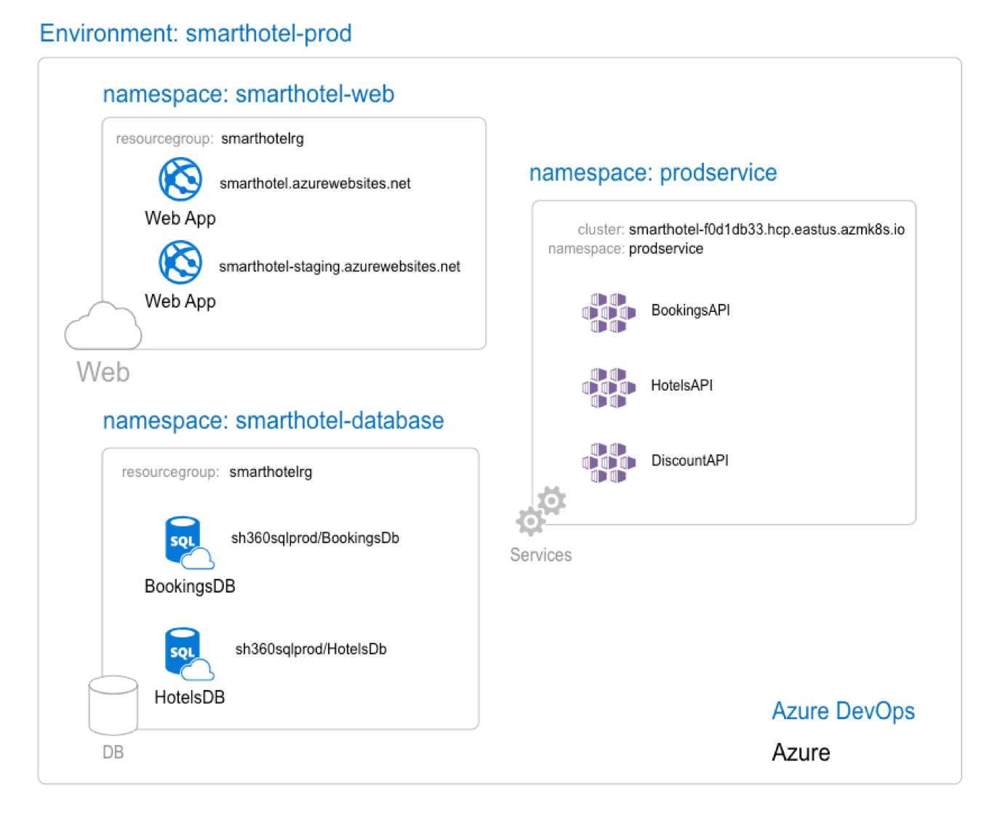

## Environments in Azure DevOps

Environment represents the resources targeted by pipelines, for example, Kubernetes clusters, app services, virtual machines, service fabric clusters etc.  Typical examples of environments are **Development**, **Test**, **QA**, and **Production**

### Why build it?

- To provide traceability from code to the physical deployment targets
- Improved visibility of resource health/availability
- Support zero downtime deployments using deployment strategies – upgrade confidently!

## Defining environments

Environment at its simplest form is just a string. The pipeline can discover and register the environment. By defining the environment in Azure DevOps, you describe where the code gets deployed. Deployments are created when the pipeline job deploys a new version of the code to the environment.

For example,

```yaml
pool:
  vmImage: 'Ubuntu 16.04'
environment: smarthotel-prod    # creates an environment 'smarhotel-prod' and records deployments against it.
```
With the above, deployment history from multiple pipelines are enabled on the environment 


### Deployment job & Environment

We will be introducing a new a `job` type called `deployment`, that can understand environments, apply deployment strategies and record deployments against the `environment`. In other words, a `deployment` job is a collection of steps to be run against the `environment`. 

```yaml
- deployment: deployWeb
  displayName: Deploy web pkg
  pool:
    vmImage: 'Ubuntu 16.04'
  environment: production    # create environment and/or record deployments
  strategy:                  # runOnce/blue green/rolling/canary, with lifecycle hooks viz, pre/post healthcheck, swap etc
    runOnce:                 # default strategy
      deploy:
        steps:       
        - script: echo deploy web pkg
```

**Note**:
- Clear separation of deployments from generic build/compute only jobs. 
- Deployment job expands into multiple jobs viz., agent, server/gate that can perform complex orchestrations with extensible lifecycle hooks.
- Existing `job` supports `matrix` and `parallel` strategies, adding `environment` support to it would add additional **mutually exclusive strategies** viz. `runOnce`, `canary`, `blueGreen`, and `rolling` to the mix. Including it in existing `job` type would complicate the user experience.
- Strong typing can help in specialized design/visual treatment


## Add resources to an environment

Typically the environment is composed of **resources**. For example, a **production** environment composed with a farm of **web** servers, and **database**. For v1, you can add the resources from UI, and refer the environment with the resources in YAML. 

For the **smarthotel-prod** environment example below, we have an environment that maps to a **Kubernetes namespace** in a cluster with one or more containerized apps (workloads) 




Example YAML

```yaml
jobs:
- deployment:
  environment: smarthotel-prod
  pool:
    name: sh-prod-pool
  strategy:                 
    runOnce:            
      deploy:
        steps:       
        - script: kubectl apply ...                        
```

Now that the smarthotel-prod has the **kubernetes namespace** linked, you can trace the deployments upto the namespace. 

### Environment with multiple resources

You can target and record deployments against each **group of resource** in an environment using JSON path notation. 

For the **smarthotel-prod** example, when we add a PaaS Database in addition to the existing Kubernetes front-end, the YAML would be,

```yaml
jobs:
- deployment:
  environment: smarthotel-prod.smarthotel-web      # smarthotel-web is the kubernetes namespace that is linked
  pool:
    name: sh-prod-pool
  strategy:                 
    runOnce:            
      deploy: 
        steps:       
        - script: kubectl apply ... 
- deployment: deployDB
  environment: smarthotel-prod.smarthotel-db       # smarthotel-db is the Azure SQL DB that is linked
  pool:
    name: sh-prod-pool
  strategy:                 
    runOnce:
      deploy: 
        steps:       
        - script: kubectl apply ... 
```

### Environment schema

Full syntax:

```yaml
environment:
  name: string  # name of the environment to run this job on.
  resourceName: string  # name of the resource in the environment to record the deployments against
  resourceId: number # resource identifier
  resourceType: string # type of the resource you want to target. Supported types: virtualMachine, Kubernetes, appService
  tags: string | [ string ] # tag names to filter the resources in the environment
```

If you are targeting the resource by name and don't need to specify tags or resourceId, this can be shortened to:

```yaml
environment: environmentName.resourceName
```

## Environment and review app resources (proposed)
Review app works by deploying every pull request from your Git repository to a dynamic environment resource. Reviewers can see how those changes look as well as work with other dependent services before they’re merged into the main branch and deployed to production.

A new macro will be introduced which get expanded by pipeline to include steps which will 
1. Create a clone of a resource (dynamically create a new resource based on an existing resource in an environment)
2. Add the new resource to the environment 

```yaml
jobs:
- deployment:
  environment: 
     name: smarthotel-dev      
     resourceName: $(System.PullRequest.PullRequestId) 
  pool:
    name: 'ubuntu-latest'
  strategy:                 
    runOnce:            
      pre-deploy: 
        steps:       
        - reviewApp: MasterNamespace 
        # name of the resource in the environment which will be used as a base for creating the new resource for review app.
        # When reviewApp macro is used, pipeline will expand the macro to include task which will create a clone of that resource and add it to the environment given as input
        # For K8s the resource maps to a namespace and for App service it will map to a new slot
        # The subsequent steps can be used to further configure the new resource and deploy changes
```
This will make it easy for customers to create and manage review app resources and benefit from all the tracebility and diagnosis capability of the environment feature.

## Future (discussion only)
`canary`, `blue-green`, and `rolling` strategies to be supported by `deployment` job. 

**Blue-Green**: Reduce deployment downtime by having identical standby environment. At any time one of them, let's say `blue` for the example, is live. As you prepare a new release of your software you do your final stage of testing in the green environment. Once the software is working in the green environment, you switch the traffic so that all incoming requests go to the green environment - the blue one is now idle.

Blue-Green example, 

```yaml
jobs:

- job: Build
  strategy:
    matrix:
      Python35:
        PYTHON_VERSION: '3.5'
      Python36:
        PYTHON_VERSION: '3.6'
  steps:
  - script: echo build/package app 

- deployment: deployWebPkg
  pool: 
    name: shProdPool
  environment: smarthotel-prod.smarthotel-web
  strategy:                 
    blueGreen:              
      deploy: 
        steps:
        - script: echo deploy web app...
      
      routeTraffic:
        delay: 60m
        steps:
        - script: echo swap slots...

      postRouteTrafficChecks:
        timeout: 60m
        samplingInterval: 5m
        steps:          
        - task: appInsightsAlerts     

      onFailure:
        steps:
        - script: echo swap slots back...

      onSuccess:
        steps:
        - script: echo checks passed...

```

**Note**
- **lifecycle hooks**: are all optional. User can just specify steps under the strategy and is considered valid.
- **resource discovery**: Current YAML scope is limited to creating an environment and tracking the deployments. Future, we can annotate system tasks to publish the resources (provisioned/targeted) to the environment.
