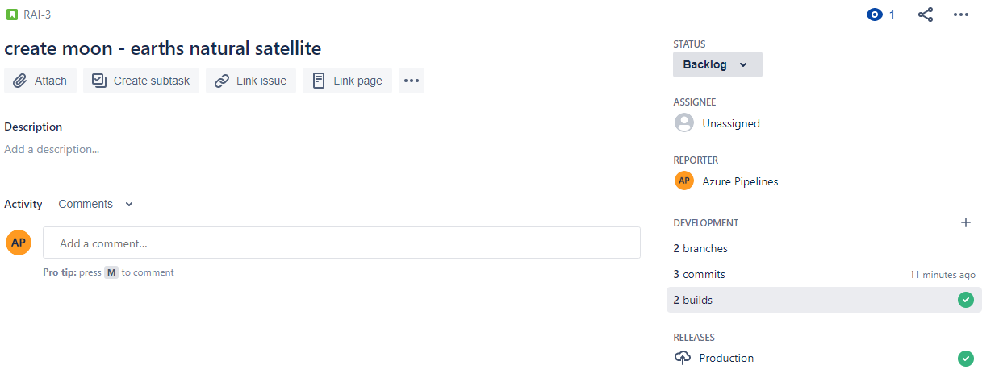
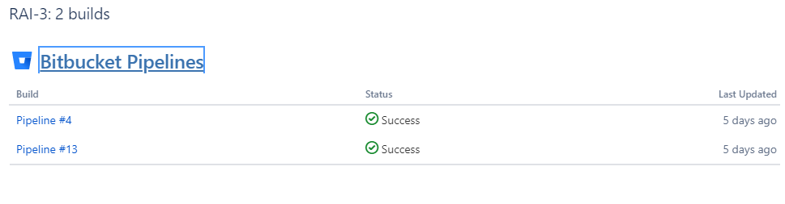
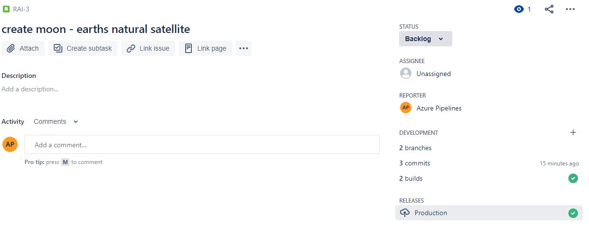
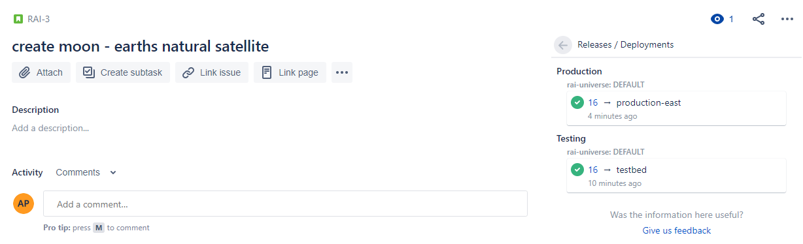

# Traceability in unified pipelines - JIRA

<p>As adoption of DevOps continues to accelerate, companies are innovating faster than ever- quickly adapting to changing customer needs and releasing at a much higher frequency. This coupled with the usage of myriad tools to plan, develop, build, deploy makes it quite cumbersome to keep a track of  the changes that are in the pipeline or already being used by the end customer.</p> 

<p> Traceability is the ability to easily follow a change across all the systems involved in the development and deployment of a software. The full potential of traceability can only be realized when all systems involved in the lifecycle of a change seamlessly exchange data and let each user persona see a coherent, cross system information while staying in the system they interact with most. <br/> In this spirit, Azure Pipelines pulls information from supported planning systems and code repositories to show a list of work items and commits that were consumed in a pipeline run. While this information is vital for customers that use pipelines primarily, we also need to push pipeline information to external sytems so that other personas can have similar rich experience. </p>  

<p> In this proposal we will discuss how we can enable this experience for users that track work items/issues in JIRA and build/deploy using Azure Pipelines</p>  

## Requirements:

The following information is required to light up traceability for JIRA: 

1. Service connection of the source repository which contains the commits of the resource. This lets us parse commit messages and obtain the JIRA issues that have been linked to commits. 
2. Service connection of the Jira server which is used to plan and track the changes done in a resource. This lets us talk to JIRA server and pull/push information.
3. JIRA specific concept mappings like [Environment Type](https://confluence.atlassian.com/bitbucket/set-up-bitbucket-deployments-968683907.html). Jira uses this  categorization to progressively expose information to users in its UI. Since azure pipeline does not have such a concept, we need to take this mapping input from the user.  
4. Filters (E.g. branch filters) to restrict the information transfer to JIRA.


## Interaction with Jira Cloud 

### Pull:
 For pulling information from JIRA we would just need the service connection of the JIRA server. Using this we can pull details of consumed work items and display the list in  azure pipelines. 

### Push:
Jira currently supports REST APIs that let external systems push build and deployment details in JIRA. There are 2 separate APIs for [build](https://developer.atlassian.com/cloud/jira/software/rest/#api-rest-builds-0-1-bulk-post) and [deployments](https://developer.atlassian.com/cloud/jira/software/rest/#api-rest-deployments-0-1-bulk-post). While JIRA depends on external services to fill these data, the work item UI is entirely painted by JIRA only. External services do not have any control over the UI.

#### Jira Build UI and APIs:
The  build results are populated in the development section of the work item UI. On further clicking on it, we see the pipeline runs that were associated with the build. 




Drill down view:


For the API, the combination of `pipelineId` (pipeline definition identifier) and `buildNumber` (pipeline run identifier) is considered as the unique identifier for a build. 

#### Jira Deployment UI and APIs:

Jira has a separate section for Deployments in its work item UI. In this, only the highest deployed environment category is displayed. Eg. If the work item was deployed to a `test` type environment and  then to `production` type, Jira shows only `production` in deployment section. On clicking on this entry the user can see details of previous deployments.



Drill down view:


For the API, the combination of `pipelineId` (pipeline definition identifier), `environmentID` (environment identifier), `deploymentSequenceNumber` (deployment identifier) constitute a unique identifier for deployment. 


#### When should the data be pushed from Azure Pipelines:?
 Based on customer interactions, customers prefer seeing the build status as soon as a build completes and deployment status when deployment to an environment is complete. Since build generation and deployments are done at a job level in azure pipelines, we'll push the status information to Jira at job boundaries. For deployments, azure pipelines already has a separate category of jobs, viz, deployment jobs. We'll invoke deployment APIs at the beginning and end of deployment jobs if all the filter conditions are met. For builds, however, we currently do not have a separate category of jobs. For this, we will assume that any job that publishes an artifact is a build job. We'll invoke build API at the end of these jobs if filter conditions are met.  


## YAML: 

Since traceability primarily involves interacting with external systems, we propose taking configuration for interaction with these external systems in a separate `integrations` section in YAML. As a beginning, we will support a first class integration with JIRA. In future, we may eventually make this section extensible thereby allowing 3rd party authors to create their own integrations. In this document, we will keep focus on JIRA integration. <em>Details on extensibility design are out of scope for this document.</em>

 

### Schema:

```yaml
integrations:       
- integration: jira # name of integration; mandatory;    
  connection: string # service connection to JIRA cloud; mandatory;
  resources: # resource filters. Status will be posted to JIRA for issues that are linked to these resources only; optional; defaults to all resources
  - repository: string #  identifier of the repository resource as defined in YAML resources section
    branches: 
      include: [ string ] # optional; defaults to all branches.
      exclude: [ string ] # optional; 
    tags:
      include: [ string ] # optional; defaults to all tags.
      exclude: [ string ] # optional;
  - pipeline: string #  identifier of the pipeline resource as defined in YAML resources section
    branches:
      include: [ string ]  # optional; defaults to all branches.
      exclude: [ string ]  # optional;
  - container: string #  identifier of the container resource as defined in YAML resources section
    tags:
      include: [ string ] # optional; defaults to all tags
      exclude: [ string ] # optional;
  environments: # environment filters. Status of deployments to only these environments will be  posted to JIRA; defaults to all environments
  - environment: string #name of environment
    type: string #environment type based on Atlassian's categorization of environment(Eg, production, staging etc). Defaults to unmapped.    
```

<br/>
<br/>


### Examples:

Day-1 configuration: The following yaml snippet is the simplest configuration and eliminates all optional fields. The status will be posted back to JIRA server for all branches of all resources consumed in any environment

```yaml
integrations:       
- integration: jira 
  connection: myJiraServiceConnection 
```

<br/>
<br/>

The following configuration will send status to all JIRA WITs linked in the commits of `zenithWorks-kernel` repository resource from `releases/*` branch only. 

```yaml
integrations:       
- integration: jira 
  connection: myJiraServiceConnection 
  resources: 
  - repository: zenithWorks-kernel 
    branches:
      include: 
      - releases/*   
```

<br/>
<br/>

The following configuration will post status to JIRA for images from `zenithworksImageRegistry` container registry that are tagged with `prod-ready`

```yaml
integrations:       
- integration: jira 
  connection: myJiraServiceConnection 
  resources: 
  - container: zenithworksImageRegistry
    tags:
      include: 
      - prod-ready  
```

<br/>
<br/>


The following configuration will send status to all JIRA WITs linked in the commits of `zenithWorks-kernel` resource. The deployment status will be posted when the resource from `releases/*` branch is deployed to `Stage-US` and `East-US` environments only.

```yaml
integrations:       
- integration: jira 
  connection: myJiraServiceConnection 
  resources: 
  - repository: zenithWorks-kernel
    branches:
    - releases/*
  environments: 
  - environment: Stage-US
    type: staging
  - environment: East-US
    type: production
```
