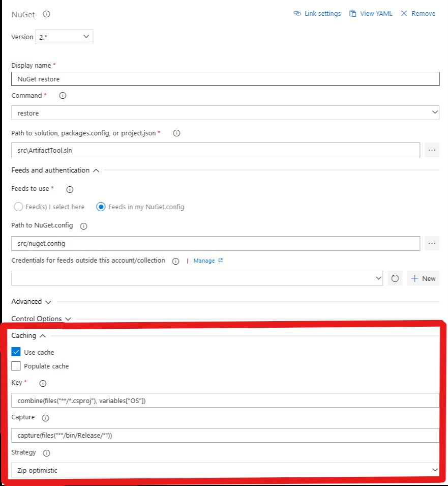

# Pipeline Caching

*** Status: Work in Progress ***

We have observed the need for Azure Pipelines to implement a caching mechanism that allows the outputs of steps within the pipeline to be skipped if a suitable cached version of the output already exists.

Provided the cost of determining a cache hit and acquiring the contents of the cache is cheaper than the cost of producing the output again from scratch then the pipeline's performance will be increased.

Caching can introduce many complexities into build pipelines and our goal is to strike the balance between "correct" and "good enough" where "good enough" allows us to provide performance benefits without a disproporionate amount of effort on behalf of the user.

## Proposal

This proposal contains a number of interelated elements. I've tried to build it up sequentially but sometimes you'll need to read further along to understand why something is the way it is.

### The basics & task integration

When work is done on an agent as part of a pipeline, it is represented as a _job_ when a set of _steps_ which are implemented by tasks. For many pipelines the YAML syntax obscures the underlying "tasky" nature of Azure Pipelines, but they are there nonetheless. As a result I'm starting with how pipeline caching will integrate with the underlying task infrastructure.

Detecting a cache hit or miss will be performend by the agent worker. As the worker prepares to execute each task it will check to see whether any given task has caching enabled and if so it will determine the key and check for a cache hit. If a hit is detected it will set about restoring the cached content into the pipeline execution environment. Exactly how that content is restored will be discussed a bit later.

The benefit of this approach is that caching can be applied to all existing tasks without any additional work by the task author. Support for caching can be enhanced to provide sensible defaults (e.g. what files to consider for cache key input).

Customers that are using the task-designer experience will be able to take advantage of pipeline caching. Cache control properties will be available in a _Caching_ group under each task in the designer.



From this screenshot you can see five inputs to the caching infrastructure:

1. **Use cache flag**; controls whether the cache is used for this task in the case of a cache hit.
2. **Populate cache flag**; controls whether this task is capable of populating the cache.
3. **Key expression**; an expression that ultimately returns a string-based key which forms the key to identify the cache contents. May be combined with other scoping information before use.
4. **Capture expression**; an expression that returns a set of things to capture. The most common case would be files, but it may also be necessary to capture things like environment variables etc which might be the output of a task.
5. **Strategy**; an option that controls how cached content will be stored. For large artifacts our dedup protocol might be most appropriate, in other cases using a zip file might be more efficient.

#### Cache use vs. population

We may want to support a model where the cache can only be populated on certain builds. For example you might want to support a model where the CI build can populate the cache (but does not use it) and a PR build can use a cache but not populate it. This could also be achieved through some kind of cache scoping mechanism.

### YAML expression

Because cache control settings are applied to all tasks they would not be specified under the inputs attribute on a task, they are elevated to a peer of inputs (like condition).

A subset of in-box tasks will be able to have caching turned on simply be setting the ```cache``` property to ```true```.

```yaml
steps:
  - task: Npm@0
    cache: true
    inputs:
      command: restore
```

When the ```cache``` property is set to ```true``` the default cache settings for use, populate, key, capture and strategy are applied for that task. Each task that supports this simplified usage will include these defaults in the ```task.json``` file so that they can be applied at runtime.

The above simplified YAML would translate to the following fully defined YAML (exact key TBD):

```yaml
steps:
  - task: Npm@0
    cache:
      use: true
      populate: true
      key:
        - files('./package.json')
      capture:
        - files('./node_modules/**')
      strategy: zip
    inputs:
      command: restore
```

This can also be simplified as:

```yaml
steps:
  - task: Npm@0
    cache:
      key: ./package.json
      capture: ./node_modules
    inputs:
      command: restore
```

Some YAML shortcuts such as the the ```script``` step can't have a default set of caching options (unless we can get some BuildXL magic working) but the cache options will be available on those steps provided the user provides sufficient cache control information.

```yaml
steps:
  - script:
    | dosomething
    | sosomethinglse
    cache:
      key: ./some_appropriate_cache_key
      capture: ./build
```

### Use statement interaction

The [use statement](use-statement.md) is an emerging pattern in the Azure Pipelines YAML document. The following YAML populates the environment with a specific version of Node.js to be used by scripts.

```yaml
- use: node
  version: 8
- script:
    | npm ci
    | npm run build
```

Caching will work in a similar way. The following example sets up caching for all subsequent steps. Cache hit checking is evaluated on a per step basis and the step itself, and its order in execution forms part of the cache key (implicitly).

```yaml
- use: cache
  key:
    - ./package-lock.json
    - ./src/client
  capture:
    - ./node_modules
    - ./build/client
- use: node
  version: 8
- script: npm ci
- script: ./node_modules/.bin/gulp
```

In the example above we are trying to avoid the need to rebuild the client-side components of a web application unless either the NPM packages have changed or the sources for the client have changed. If either the package lock file or the sources change then both script steps will be run - it would ineffect be the same as the following YAML:

```yaml
- use: node
  version: 8
- script: npm ci
  cache:
    key:
      - ./package-lock.json
      - ./src/client
    capture:
      - ./node_modules
      - ./build/client
- script: ./node_modules/.bin/gulp
    key:
      - ./package-lock.json
      - ./src/client
    capture:
      - ./node_modules
      - ./build/client
```

Note however that because the script steps are evaluated independently for a cache hit, the ```use``` statement is simply a more concise way of setting the same cache settings on subsequent steps in the pipeline.

### Key expressions

Selecting the right key for the cache is critical in order to produce _correct_ or event _good enough_ results. For example if a Node.js module is designed to work across multiple platforms and takes native dependencies that need to be compiled using _node-gyp_ (for example) then the cache will need to include sufficient platform information to differentiate caches on Windows, macOS and Linux and sub-flavors for really specific native dependencies.

The cache key expression syntax is inspired by the ```condition``` property present on all tasks. However instead of returning a boolean result it returns a string which is then combined with some intrinsic properties (such as cache scope). Out of the box we should provide the following functions which can be added to an expression (examples)

1. ```files('./package-lock.json')``` or ```files('**/*.csproj')``` or ```files(['file1','file2'])```
2. ```variables('MY_VARIABLE')``` or ```variables('MY_VARIABLES_*')``` or ```variables(['MY_VARIABLES_*', 'OTHER_VARIABLE'])```
3. ```stdout('./script/to/compuete/key.sh', 'args')```

The strong that these expressions return is actually a fragment of JSON which is appended into an array. The caching logic would then process the JSON document to compute hashes of each value and merge it together to produce the key.

### Capture expressions

Capture expressions would work in a simular way to cache key expressions. They would support the ```files``` and ```variables``` functions specified above except when the caching logic processed the JSON document that the expression generates it would use it to generate a map of contents to be added to the cache. The expression would also be used to extract the contents from the cache.

### Caching strategies

Our experiments to date with caching have shown that there doesn't appear to be a single caching solution that works perfectly in all scenarios. For that reason we expect to need the ability to specify different caching scenarios on a per step basis to obtain the best performance. Where specific tasks are used an optimal default caching solution should be specified, in more generic scenarios such as ```script``` steps a reliable default would be used. The following have been identified as possible caching strategies:

1. ***Zip***; archive all captured cache content an upload to the Azure Artifacts build cache service. On cache hit download unpack and place contents.
2. ***Dedup***; upload all content via the dedup protocol. Ideal for larger artifacts which respond well to chunking (benefits for capture).
3. ***Virtualized***; a variant of dedup where captured paths are presented virtually and content is downloaded transparently on demand (ideal for sparse cache access).

In addition to these top level caching strategies, there may be variants of them which can be used to optimistically pre-fetch content from the cache in the background whilst earlier steps in the build are still executing. This optimistic caching mode can be activiated as follows:

```yaml
steps:
  - script:
      | npm install
      | npm run build
  - script: dotnet build
    cache:
      key: **/*.csproj
      capture: ./build/service
      strategy:
        name: Dedup
        variant: optimistic
```

In the scenario above we know that the NPM build pay take some time to run but because we know that the NPM build won't intersect with the .NET Core build we can instruct the work to pre-fetch and place the captured build outputs if it can detect a cache hit early. It would only do this in cases where the cache strategy variant is set to optimistic.

Caching strategies may also require additional configuration. One of the things that we want to investigate is whether we can use BuildXL as part of this caching solution to intelligently produce a cache key (fingerprint) based on the command being executed. Using BuildXL will require additional configuration to explicitly ignore certain paths and other OS-level interations to tune the fingerprint. For example:

```yaml
steps:
  - script:
      | cmake ...
      | make ...
    cache:
      key: buildxl()
      capture: ./build
      strategy:
        name: BuildXL
        configuration:
        - name: specialvariable1
          value: specialvalue1
        - name: specialvariable2
          value: specialvalue2
```

### Sidecar processes

This specification assumes that the worker is where caching activity is managed rather than individual tasks. This means we can add caching capabilities broadly within Azure Pipelines. However to reduce the risk of instability in the build process our plan is to introduce caching functionality in a sidecar processes which is spawned by the worker which takes care of all cache management operations. The worker would communicate cross process to the sidecar process to get it to perform operations such as checking keys and capturing and uploading content.

If the sidecar process dies for whatever reason the worker could either fail the build or resume with caching disabled (with appropriate warning messages). The sidecar would be the process host for virtualized cache acess and also act as a proxy for specific scenarios.

### Cache namespaces and security model

We already have a build cache in Azure Artifacts that is used within Microsoft. We should plan on extending this to support the Azure Pipelines caching scenarios since it is already battle tested at 1ES scale.

As part of the existing API we have a namespacing mechanism which allows us to create multiple independent namespaces for cache keys (and their associated content). We should use this mechanism to isolate the caches for pipelines and provide a security mechanism.

Cache namespaces should be definable in YAML as a resource:

```yaml
resources:
  cache-namespaces:
  - cache-namespace: name-of-scope
```

If no cache namespace is defined explicitly in the YAML the "self" name is implied and the name of namespace is generated based on the details of the pipeline. It is also possible to define multiple cache namespaces:

```yaml
resources:
  cache-namespaces:
  - cache-namespace: namespace-name-one
  - cache-namespace: namespace-name-two
```

When multiple namespaces are in use there is another cache control property that can be specified on a per step basis (or in the use statement):

```yaml
resources:
  cache-namespaces:
  - cache-namespace: namespace-name-one
  - cache-namespace: namespace-name-two
steps:
- script: npm install
  cache:
    key: ./package-lock.json
    capture: ./node_modules
    namespace: namespace-name-two
```

Opening up the possibility of shared caches means that inappropriate cache access could result in nefarious content being injected into the cache to bypass inspection of pull requests (e.g. setup a pipeline that populates a shared cache with mallicous code based on an easily computable key) or accidentally stored secrets being exfiltrated from the build pipeline.

Therefore cache namespaces will need to be regarded as a securable. We will need to have a cache namespace UX either in Azure Pipelines or Azure Artifacts which shows the list of cache namespaces and which users have explicit access to them. This would be the set of users that have the rights to update the YAML/designer definition to allow a given pipeline to access those caches. This rights check would be applied when the definition is updated and composition of rights would limit which cache namespaces code running in the context of the agent could use.

This UX would also provide a convienient place to trigger flushing of the cache and look at the cache namespace size and utilization.

### Retention & extension

Cache content should be considered volatile, however we should make the retention period configurable with a default retention of 7 days (the default of blobs in the Azure Artifacts content store). But in scenarios where builds against a particular code base are infrequent we should support this retention period being raised on a per namespace basis. This setting would be controlled in the UX.

Within the cache namespace UX all cache keys and the size of their associated content should be listed. Owners of the cache namespace should be able to go in and manually flush an individual key or extend its lifetime.

### Outer caching vs. inner caching

This proposal has focused on applying caching at a task/step level rather than considering how to achieve caching at a sub-script level. Many code bases that are being migrated to Azure Pipelines have pre-existing build scripts which may benefit for subsets of their execution using caching. To assist this the cache control options in YAML will support the definition of a "cache command variable" which can be used within a script to hand-off to the caching implementation in Azure Pipelines. Here is an example:

```yaml
steps:
- script: ./build.sh
  cache:
    key: ./src/dependencies
    capture: ./build
    command-variable: STEP_CACHE_COMMAND
```

Inside the ```build.sh``` script the developer could then test for the presence of this variable and execute it passing in the operation that they want to have cached, for example:

```bash
#!/bin/bash
# Script before cached operation.

if [[-z "${STEP_CACHE_COMMAND}"]]; then
  ${STEP_CACHE_COMMAND} cmake ...
  ${STEP_CACHE_COMMAND} make ...
else
  cmake ...
  make ...
fi

# Script after cached operation.
```

In the scenario above the ```${STEP_CACHE_COMMAND}``` variable points to a generated script which contains pre-configured arguments to call out to the side-car cache process to check for a cache hit and either run the specified commands or place the cached reults back on disk.

The text after ```${STEP_CACHE_COMMAND}``` forms part of the cache key as does other environmental information such as the working directory. This means that a single cache control configuration can actually result in multiple independent cache entries being added to the cache namespace.

When the ```command-variable``` property is set, caching is not applied to the task/step as a whole as that would defeat the point of the mechanism.

The use statement can also participate in the ```command-variable``` mechanism. Using multiple use statements to configure command variables allows a single script to use completely different caching mechanisms for different parts of the script. For example (YAML):

```yaml
steps:
- use: cache
  key: ./src/dependencies
  capture: ./build/libs
  command-variable: NATIVE_BUILD_CACHE
- use: cache
  key: ./src/web/package-lock.json
  capture: ./build/web
  command-variable: WEB_BUILD_CACHE
- script: ./build.sh
```

In the example above we are configuring two command variables which can be used within the script ```build.sh``` independently. So the development script could look something like this:

```bash
# Build native dependencies.
if [[-z "${NATIVE_BUILD_CACHE}"]]; then
  ${NATIVE_BUILD_CACHE} cmake ...
  ${NATIVE_BUILD_CACHE} make ...
else
  cmake ...
  make ...
fi

# Build web front-end
if [[-z "${WEB_BUILD_CACHE}"]]; then
  ${WEB_BUILD_CACHE} npm install
  ${WEB_BUILD_CACHE} gulp
else
  npm install
  gulp
fi
```

## Summary

The goal of this proposal is to provide a comprehensive caching mechanism to Azure Pipelines that can be deployed in a variety of scenarios whether you are using the task-based designer, the new YAML syntax and whether you are bringing your own build scripts which just need a little bit of help to optimize performance. Enabling caching can be as easy as adding a single property to one of our in-box tasks (example):

```yaml
steps:
- task: Npm@0
  cache: true
  inputs:
    - command: restore
```

... or adding caching to an entire block of scripts:

```yaml
- use: cache
  key:
    - ./package-lock.json
    - ./src/client
  capture:
    - ./node_modules
    - ./build/client
- use: node
  version: 8
- script: npm ci
- script: ./node_modules/.bin/gulp
```

... or within a script in the examples in the previous section. This proposal is to _meet pipeline users where they are_ and provide just enough to meet their needs without requiring wholesale changes to their pre-existing build process.