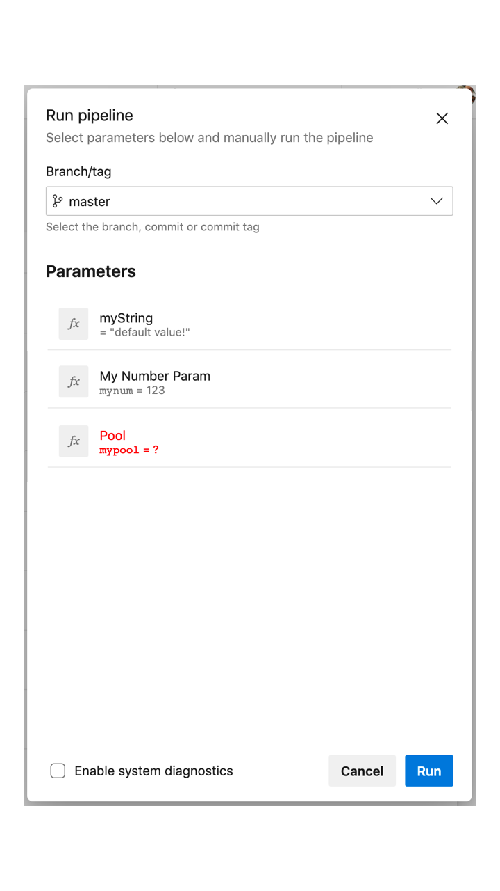

# Runtime and type-safe parameters

**Status**: implemented, with some changes from the below information.
See [the official documentation](https://docs.microsoft.com/azure/devops/pipelines/process/runtime-parameters) for latest information.

We need a way to take run-time inputs, giving pipeline authors the right amount of control / expressivity.
YAML pipelines already accept parameters when used as part of a template.
Runtime parameters are a natural evolution of that syntax.
Along the way, we will augment the capabilities of template parameters in a natural way.

Scenarios:
- Pipeline users can supply different values to tools and tasks at run time
- Pipeline authors can control the types, ranges allowed, and defaults for run-time parameters
- Pipeline authors can allow flexible, run-time control over stages/jobs to run, including adding/removing matrix legs
- The pipeline itself can be altered at run time: pools, agentspecs, service connections, environments, and more
- The runtime values can be used in template expressions (`${{ if }}`, for example), for instance so that jobs/steps can be dynamically selected (this is not currently possible because queue-time variables are not available during template expansion)

## Syntax

```yaml
parameters:
# this is a sequence, so the block may be repeated as many times as needed
- name: string          # name of the parameter; required
  displayName: string   # UI string
  type: # data type; see below
  default: any          # default value; if no default, then the parameter MUST be given by the user at runtime
  values: [ string ]    # allowed list of values (for some data types)
  secret: bool          # whether to treat this value as a secret; defaults to false
```

See [below](#back-compat-with-current-syntax) for details about how this coexists with existing `parameters` syntax.

## Run panel ("queue dialog")

Given this YAML:

```yaml
parameters:
- name: myString
  type: string
  default: 'default value!'
- name: mynum
  displayName: 'My Number Param'
  type: number
  default: 123
- name: mypool
  displayName: 'Pool'
  type: pool
  values:
  - ubuntu-latest
  - windows-latest
  - macos-latest

pool: ${{ parameters.mypool }}

steps:
- script: echo ${{ parameters.myString }} was entered at runtime!
- ${{ if not(eq(parameters.mynum, 123)) }}:
  - script: echo You overrode the default number to ${{ parameters.mynum }}
```

The run panel would look something like this:



`myString` is a parameter name with no display name.
`My Number Param` is the display name of `mynum`.
Both have defaults, unlike `mypool`.
The run cannot be started until `mypool` is selected.

This PM art does not attempt to show the various editors and widgets.
That's a future exercise for design and product to work on together.

## Data types

### Data types for runtime parameters

| Data type | Notes |
|-----------|-------|
| `string` | default data type if none is specified
| `number` | may be restricted to `values:`, otherwise any number-like string is accepted
| `boolean`
| `object` | YAML serialization expected
| `filePath`
| `secureFile`
| `pool`
| `serviceConnection`
| `environment`

### Data types for template parameters

It's also useful to tighten up the editor experience and error messages for template parameters.
Customers are already using templates to pass along step and job lists.
These aren't particularly useful for run-time parameters.
They're rendered like a plain `object` in the UI.

| YAML string type | Notes |
|------------------|-------|
| `step` | a single step
| `stepList` | sequence of steps
| `job` | a single job
| `jobList` | sequence of jobs
| `deployment` | a single deployment job
| `deploymentList` | sequence of deployment jobs
| `stage` | a single stage
| `stageList` | sequence of stages

## Other properties
### `default`
For top-level pipelines: if a default is given, then the UI prepopulates that value.
For non-top-level pipelines: if the parameter value isn't specified, then default is used.

### `values`
If `values` is specified, then the user must choose from one of the provided values.
No other values are accepted.

### `secret`
If true, the contents of this parameter are consider secrets.
They're suppressed in output logs, for example.

## Full examples

### Dial in the amount of parallelism

```yaml
parameters:
- name: parallelism
  displayName: How much parallelism
  type: number
  default: 5
  values:
  - 1
  - 5
  - 10

job: Test
strategy:
  parallel: ${{ parameters.parallelism }}
steps:
- script: echo Running one leg of tests...
```
 
### Select configs to run

```yaml
parameters:
- name: configs
  type: string
  default: 'x86,x64'

jobs:
- ${{ if contains(parameters.configs, 'x86') }}:
  - job: x86
    steps:
    - script: echo Building x86...
- ${{ if contains(parameters.configs, 'x64') }}:
  - job: x64
    steps:
    - script: echo Building x64...
- ${{ if contains(parameters.configs, 'arm') }}:
  - job: arm
    steps:
    - script: echo Building arm...
```

### Select your pool

```yaml
parameters:
- name: pool
  type: pool
  default: ubuntu-16.04
- name: mySecret
  type: string
  secret: true

job: Build
pool:
  vmImage: ${{ parameters.pool }}
steps:
- script: echo Building on the pool of your choice
- script: echo You used secret ${{ parameters.mySecret }}  # this will echo "You used secret ***"
```

### Selectively omit a stage

If you have a stage to selectively knock out, that can be modeled this way.
(CD pipelines will have arbitrary start/stop stages built in natively, so users won't have to proliferate variables all over the place.
It's helpful when there's just 1-2 that you want explicit control over.)

```yaml
parameters:
- name: runPerfTests
  type: boolean
  default: false

stages:
- stage: Build
  jobs:
  - job: Build

- stage: UnitTest
  dependsOn: Build
  jobs:
  - job: UnitTest

${{ if eq(parameters.runPerfTests, true) }}:
  - stage: PerfTest
    dependsOn: Build
    jobs:
    - job: PerfTest

- stage: Deploy
  dependsOn: UnitTest
  jobs:
  - deployment: Ring0
```

### Select a template at runtime

```yaml
parameters:
- name: experimentalTemplate
  displayName: 'Use experimental build process?'
  type: boolean
  default: false

steps:
- ${{ if eq(parameters.experimentalTemplate, true) }}:
  - template: experimental.yml
- ${{ if not(eq(parameters.experimentalTemplate, true)) }}:
  - template: stable.yml
```

### Connecting template parameters with strong typing

This is common for sophisticated customers such as .NET.
_Note: this isn't about runtime and UI-specified parameters as such, but it's an important capability of parameters._

```yaml
# template.yml - comes from the centralized infrastructure team

parameters:
- name: customerSteps
  type: stepList

steps:
- script: echo Pre-step injected on all jobs
- ${{ each customerStep in parameters.customerSteps }}:
  - ${{ customerStep }}
- script: echo Post-step injected on all jobs
```

When a client repo such as Roslyn goes to consume this template:

```yaml
# azure-pipelines.yml - in the Roslyn repo

resources:
  repositories:
  - repository: arcade
    name: dotnet/arcade

steps:
- template: template.yml@arcade
  parameters:
    customerSteps:
    - task: Foo@1
    - script: echo bar
```

At runtime, we know that `customerSteps` must be a list of steps.
If it's not, we can give a clear error message.
In the future, our editing experiences can also make this easy to reason about.

## Back-compat with current syntax

The existing `parameters` syntax expects a map of parameters with their defaults.
Since the value of a parameter can be anything including a map, we wouldn't be able to tell whether the customer meant to use the old syntax or the new, richer syntax.
That's why the new syntax is a sequence of defined objects, allowing us to preserve back-compat.

Example of current syntax:
```yaml
parameters:
  image: 'ubuntu-16.04'   # scalar parameter
  preSteps:               # sequence parameter
  - script: echo foo
  vars:                   # map parameter
    NODE_VERSION: '8.x'
    PYTHON_VERSION: '3.7'
```

Since existing parameter syntax is only for templates, none of the parameters are settable at run time.
The above example is equivalent to:
```yaml
parameters:
- name: 'image'     # scalar parameter
  type: object      # it becomes an object, but that's cast to string later
  default: 'ubuntu-16.04'
- name: 'preSteps'  # sequence parameter
  type: object
  default:
  - script: echo foo
- name: 'vars'      # map parameter
  type: object
  default:
    NODE_VERSION: '8.x'
    PYTHON_VERSION: '3.7'
```

## Future additions

**These are out of scope for v1.**

### Comment triggers

GitHub `/azp` commands will also need to be able to pass values to the parameters.
For v1, it's enough to let the defaults win.
A pipeline with a parameter that doesn't have a default value will result in an error if queued using `/azp run`.
In the future, the command syntax will be expanded to allow setting values.

### Editor experiences

We can teach the editors (web, VS Code) how templates fit together.
When a user's pipeline consumes a template, we can offer IntelliSense for the names and allowed values of parameters.

### Display hints

Optionally, the pipeline author can hint to the UI what widget should be displayed.
Not all widgets are compatible with all data types, and UI may evolve over time, so these are only hints.

```yaml
parameters:
- name: string          # name of the parameter; required
  displayName: string   # UI string
  type: enum            # data type
  displayHint: enum     # display widget, see below
```

| Display hint | Compatible data types | Default for |
|--------------|-----------------------|-------------|
| `oneline` | string, number | string, number
| `multiline` | string, object | object
| `pickList` | number, boolean, enum | enum
| `checkbox` | boolean | boolean
| `radio` | number, boolean, enum | -

For data types not listed in the above table, there is a "special" UI (such as a file picker, pool picker, etc.) that's automatically used.
